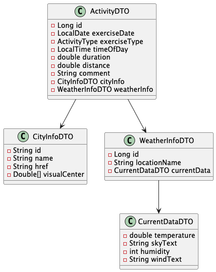
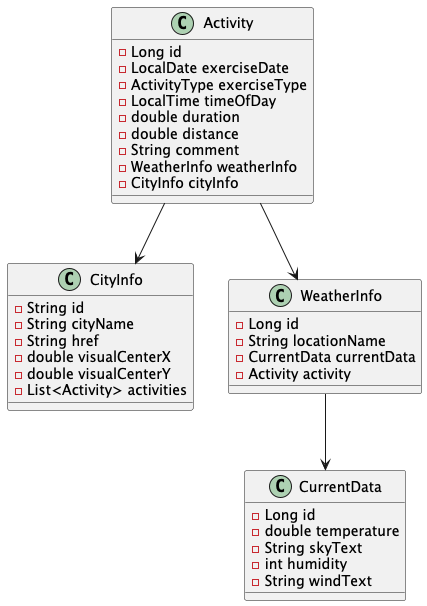
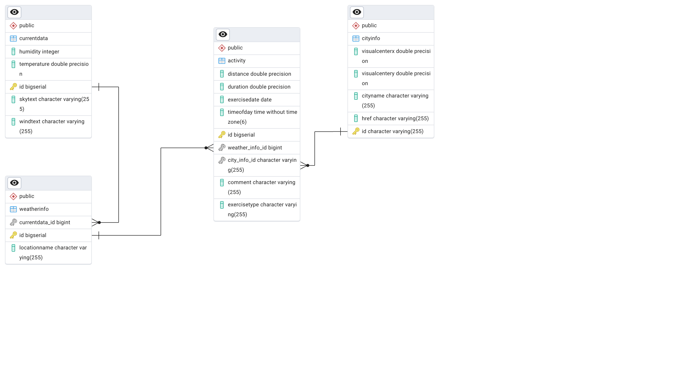

# Activity Logger Exercise

Includes:

- IntelliJ setup
- JPA dependencies
- Lombok
- Junit 5
- Postgres drivers
- Test containers

Is created for Java 17 corretto

This is a rough solution to the exercise part 2: 

- [https://dat3cph.github.io/material/deepdive-2/exercises/activity-logger-part-2/](https://dat3cph.github.io/material/deepdive-2/exercises/activity-logger-part-2/)

## Class diagrams

### DTOs

### Entities

## ERD

